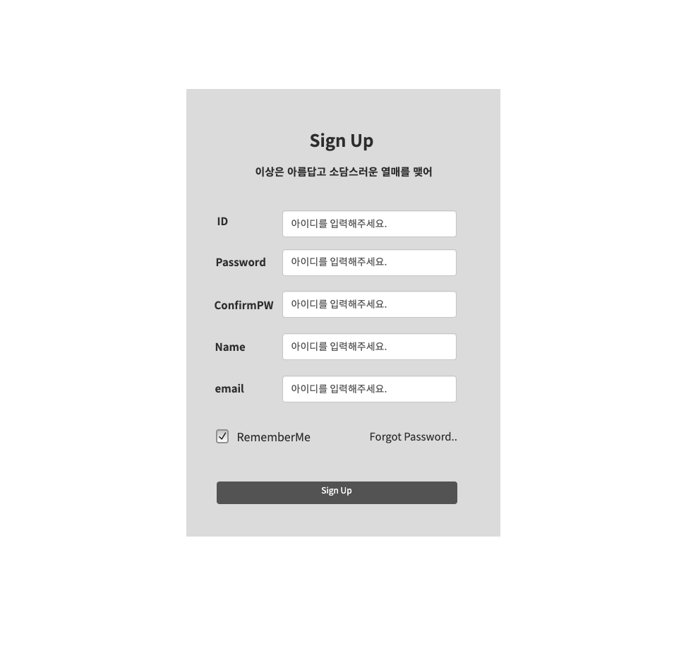
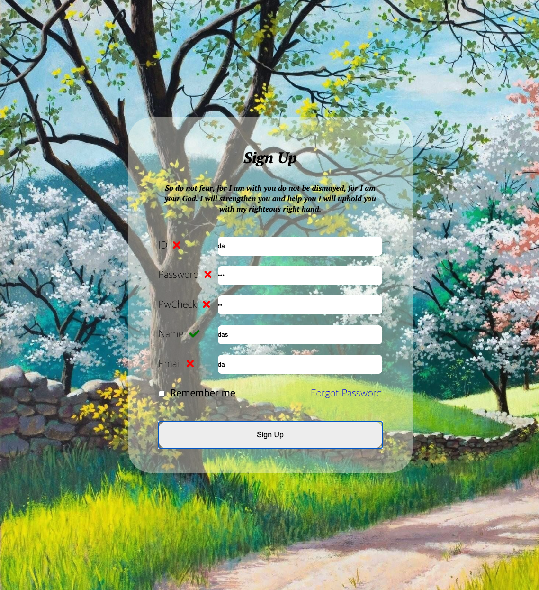
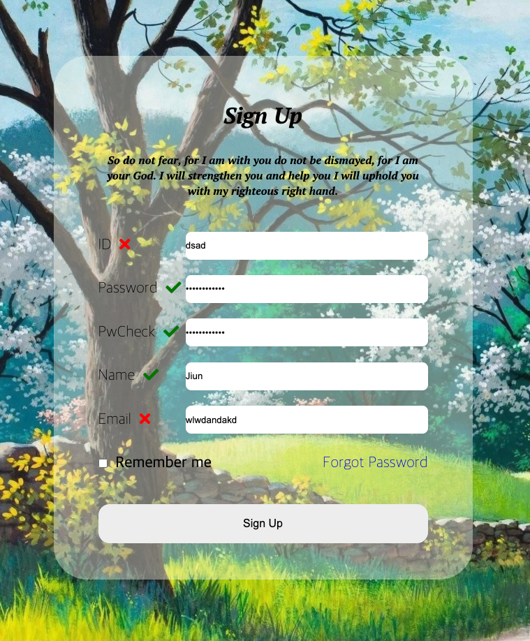
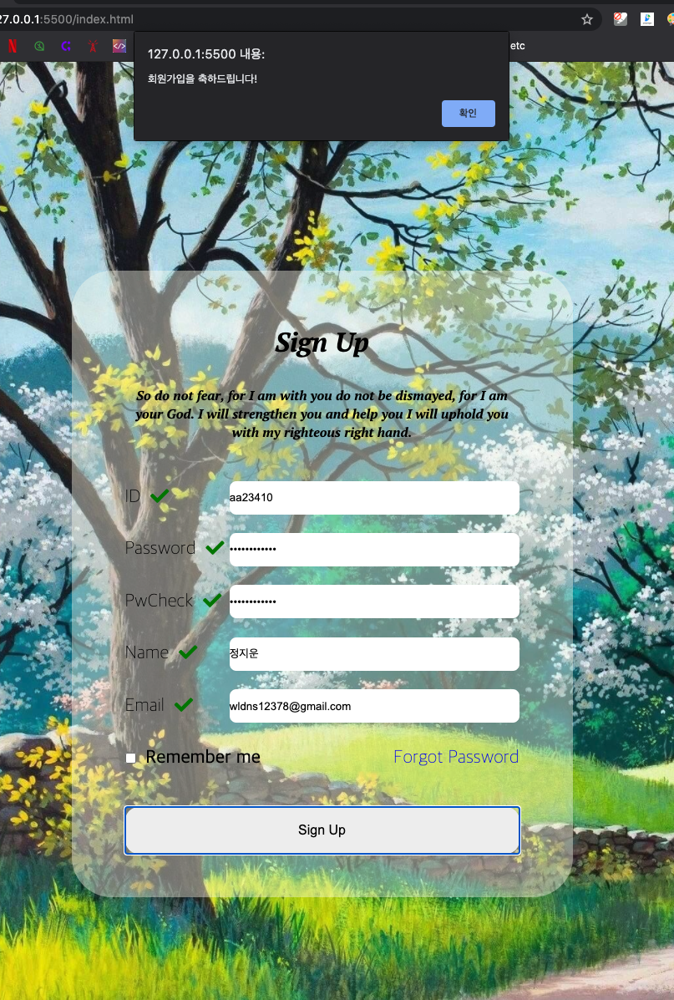

# login-form-validation

## layout - before

## complete - after

### 요소 검사
// 0 Sign Up 눌렀을때 -> alert : 모든 벨리데이션 통과했을때는 '축하문구' 아닐때는 '확인하세요'
// 1 아이디 : 영어랑 숫자만 들어오게하고 5자 이상
// 2 비밀번호 : 8자이상 문자 숫자 특수문자 1개씩 꼭 조합해야함
// 3 비밀번호 확인 : 비밀번호와 대조
// 4 이름 : 공백만 체크
// 5 이메일 : 문자사이에 골뱅이가 있어야하며, .이 있어야한다.

## validation - fail

## validation - success

